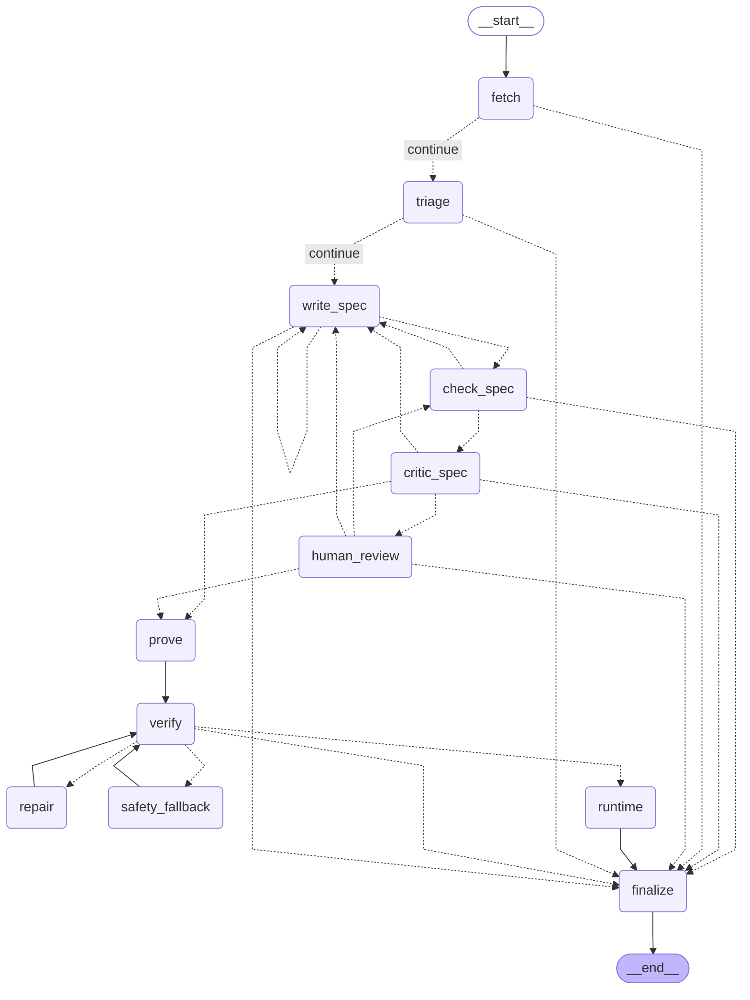

# lcverus pipeline (LangGraph)

```mermaid
---
config:
  flowchart:
    curve: linear
---
graph TD;
	__start__([<p>__start__</p>]):::first
	fetch(fetch)
	triage(triage)
	write_spec(write_spec)
	check_spec(check_spec)
	critic_spec(critic_spec)
	human_review(human_review)
	prove(prove)
	verify(verify)
	repair(repair)
	safety_fallback(safety_fallback)
	runtime(runtime)
	finalize(finalize)
	__end__([<p>__end__</p>]):::last
	__start__ --> fetch;
	check_spec -.-> critic_spec;
	check_spec -.-> finalize;
	check_spec -.-> write_spec;
	critic_spec -.-> finalize;
	critic_spec -.-> human_review;
	critic_spec -.-> prove;
	critic_spec -.-> write_spec;
	fetch -.-> finalize;
	fetch -. &nbsp;continue&nbsp; .-> triage;
	human_review -.-> check_spec;
	human_review -.-> finalize;
	human_review -.-> prove;
	human_review -.-> write_spec;
	prove --> verify;
	repair --> verify;
	runtime --> finalize;
	safety_fallback --> verify;
	triage -.-> finalize;
	triage -. &nbsp;continue&nbsp; .-> write_spec;
	verify -.-> finalize;
	verify -.-> repair;
	verify -.-> runtime;
	verify -.-> safety_fallback;
	write_spec -.-> check_spec;
	write_spec -.-> finalize;
	finalize --> __end__;
	write_spec -.-> write_spec;
	classDef default fill:#f2f0ff,line-height:1.2
	classDef first fill-opacity:0
	classDef last fill:#bfb6fc

```
